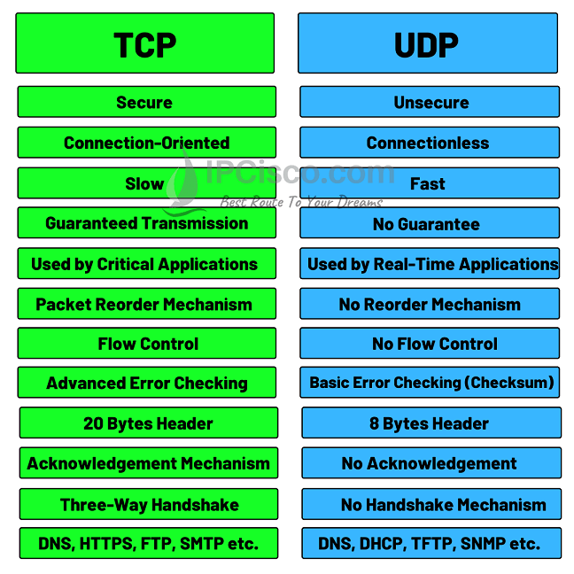

# TCP et UPD 
|   Facteur   |   TCP |   UDP 
|---    |:-:    |:-:    
|   Type de connexion  |   Connexion requise avant de transmettre des données   |  Aucune connexion requise pour démarrer et terminer un transfert de données
|   Séquence de données   |   Oui (ordre spécifique)  |   Non (pas d'ordre)
|   Retransmission des données  |   Possible, données récupérables   |   Pas possible, données irrécupérables
|   Livraison  |   Garantie   |   Pas garantie
|   Controle d'erreurs  |   Approfondie, arrivé dans l'état prévu garantit   |   Minimale, ne permet pas forcémment d'éviter toutes les erreurs
|   Radiodiffusion  |   Oui   |   Non
|   Rapidité  |   Transmission lente mais complète   |   Transmission rapide mais risque incomplète
 
## TCP idéal pour 
- Email ou SMS
- Tranfert de fichier
- Navigation Web

## UDP idéal pour 
- Streaming en direct
- Jeu vidéo en ligne
- Chat vidéo

## Comparaison

## Comparatif pour l'envoi de données
Pour des données classiques, les deux se valent, cela dépend juste de nos exigences et du contexte \

Cependant pour les envois de flux d'information en direct, il se trouve qu'UDP sera plus adapté que TCP. \
Notamment grâce au fait qu'UDP autrorise la perte de paquet ce qui peut arriver et n'est pas très dérangeant dans la transmission de flux. Le fait qu'il l'autorise est bien car la perte de paquet ne va pas perturber le reste de la communication
