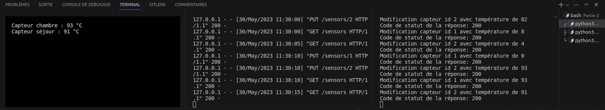

# Approches à base de http/https
## Pourquoi ?
- **Sécurité** : HTTPS ajoute une couche de chiffrement SSL/TLS (Secure Sockets Layer/Transport Layer Security) aux communications HTTP.
- **Confidentialité des données**:  HTTPS chiffre les données en transit, ce qui rend extrêmement difficile pour les attaquants d'intercepter et de déchiffrer les informations confidentielles.
- **Authentification** : HTTPS utilise des certificats SSL/TLS pour authentifier les serveurs et garantir que les utilisateurs se connectent au bon site Web. Les certificats sont délivrés par des autorités de certification (CA) de confiance.
- **Norme de facto** : Au fil du temps, HTTPS est devenu une norme de facto pour de nombreux services et applications en ligne. Les navigateurs modernes marquent les sites Web non sécurisés (HTTP) comme « non sécurisés » pour sensibiliser les utilisateurs aux risques potentiels. 
- **SEO et référencement** : Les moteurs de recherche, tels que Google, donnent la priorité aux sites Web sécurisés en HTTPS dans leurs résultats de recherche.
## Exemple interaction navigateur <=> application python
- **Scraping web** : Utilisez BeautifulSoup pour extraire des données d'une page web via HTTP/HTTPS.
- **Envoi de requêtes** : Utilisez Requests pour envoyer des requêtes HTTP/HTTPS depuis Python vers un serveur web, pour interagir avec des API, récupérer des données ou envoyer des formulaires en ligne.
- **Création de serveur web** : Utilisez Flask ou Django pour créer une application web côté serveur. Le navigateur envoie des requêtes HTTP/HTTPS à votre application Python, qui les traite et renvoie des réponses.
## Exemple interaction entre code python
- **Communication entre deux applications Python** :
- - L'application A envoie une requête HTTP/HTTPS à l'application B 
- - L'application B reçoit la requête, et renvoie une réponse à l'application A.
- **Intégration de services tiers** :
- - Une application Python utilise des services tiers (par exemple, des services de messagerie ou de paiement) en effectuant des appels HTTP/HTTPS pour interagir avec ces services.
- - Les services tiers reçoivent les requêtes, effectuent les opérations demandées et renvoient les résultats à l'application Python.
- **Échange de données entre différents composants d'une application web** : 
- - Différents composants d'une application web Python communiquent entre eux via des requêtes HTTP/HTTPS.

# API Flask
## Architecture 
- API basique pytohn flask, nous la rendront statefull avec unstockage dans un système de fichier JSON
- Un fichier .json par entité, il sera possible de faire des opérations CRUD dessus
- Des méthodes et des routes pour chaques opérations CRUD 
- Deux méthodes pour chaque entié, une permettant de lire le fichier de stockage de l'entité et une permettant d'écrire
- Notre API suivra un modèle Controller Service et Repository afin de séparer les roles et pouvoir mieux comprendre ce qu'il se passe (debug plus simple par exemple)
## Fonctionnement 
Pour respecter le cahier des charges nous avons d'abord imaginer un fonctionnement basique suivant : 
- API avec un entité capteur qui comme propriété 
- - id 
- - name
- - temp
- 2 méthodes mises a disposition 
- - getAllCapteur
- - updateCapteur
- 2 agents externes à l'api
- - capteurSimulateur 
- - - Envoie toutes les 10 secondes une mise à jour pour 2 capteurs dans l'api 
- - client
- - - Demande régulièrement la température des capteurs et les affiche (ces températures seront donc mise à jour par le capteur simu)

## Implémentatoin du fonctionnement basique 
- Lancement de l'api en lançcant la commande `python3 app.py`, inaller au préalable flask avec la commande `pip3 install flask`
- Aller sur l'URL `http://127.0.0.1:5000/sensors`
- Lancer la commande 
``` bash
 curl -X PUT -H "Content-Type: application/json" -d '{"id":2, "name":"Capteur séjour","temp":35}' http://localhost:5000/sensors/2
 ```
 afin de mettre à jour la température du capteur 2 
- Vérifier que la mise à jour est bonne en retournant sur l'URL `http://127.0.0.1:5000/sensors`
## Lancement du système
On peut donc lancer le fichier `app.py` afin de lancer notre api et la rendre accessible \
Il faut ensuite lancer en parallèle les fichier `client` et `sensorSimulator` pour avoir le résultat suivant : 


## Evolution et ajout des autres comportements
### Ajout des capteurs de proximité 
